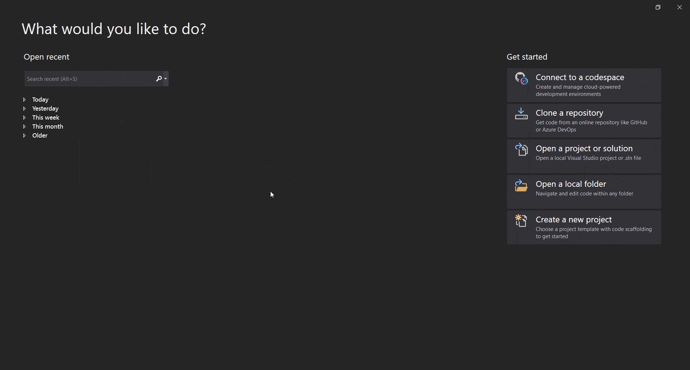
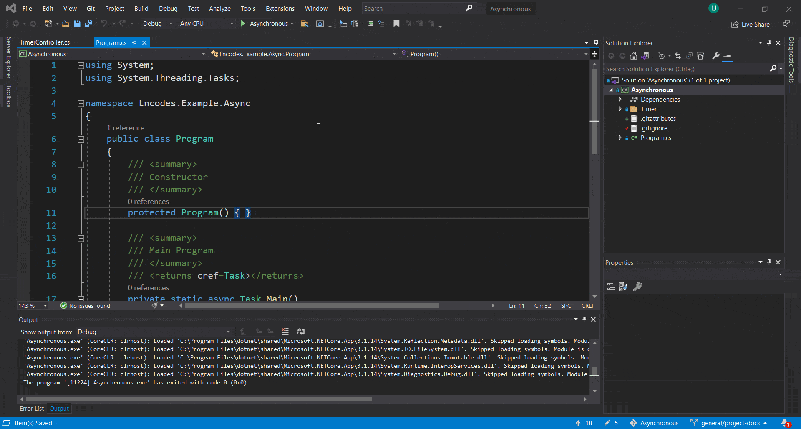

<br>
<p align="center">
  &nbsp;&nbsp;&nbsp;&nbsp;&nbsp;&nbsp;&nbsp;<a href="https://lncodes.com">
    </img>
  </a>
</p>

<h1 align="center">C# Asynchronous</h1>
<p align="center">
  <a href="https://github.com/lncodes/csharp-asynchronous/actions/workflows/build.yml">
      
  </a> 
  <a href="https://sonarcloud.io/dashboard?id=lncodes_csharp-asynchronous">
      
  </a>
</p>

<p align="center">
  <a href="#introduction">Introduction</a> •
  <a href="#setup">Setup</a> •
  <a href="#contribute">Contribute</a> •
  <a href="#discuss">Discuss</a> •
  <a href="#support">Support</a> •
  <a href="#license">License</a>
</p>

---

<h2 id="introduction">✨ Introduction</h2>

This project is part of the tutorial content, and this project will show you an example implementation of **C# Asynchronous**. To see the tutorial content, you can refer to the [Tutorial Content](https://lncodes.com/tutorial/csharp/asynchronous/). 

<h3 id="objective">🎯 Objective</h3>

Here some objective we want to achieve from this project :
1. Create a simple example of **C# Asynchronous** implementation that can be understood by new programmers who want to learn C# Asynchronous.
2. Create example implementation of **C# Asynchronous** that are relevant over time.

<h2 id="setup">🧰 Setup </h2>

> For this setup, I use Visual Studio as the IDE.
### ⚙️ Installation 
Follow these steps to install the **C# Asynchronous** project
1. Clone or download this project.
``` bash 
git clone https://github.com/lncodes/csharp-asynchronous.git
```
2. Open the project solution in the src folder.



### 💻 Usage
To use this project, you need to press the Run Button in your Visual Studio.



<h2 id="contribute">💖 Contribute</h2>

Want to contribute to this project? Please read our project [Contribution Guidelines](CONTRIBUTING.md).

<h2 id="discuss">💬 Discuss</h2>

If you have any questions about this project, you can go to [Discussion Forum](https://github.com/lncodes/csharp-asynchronous/discussions) or directly comment on the [Tutorial Content](https://lncodes.com/tutorial/csharp/asynchronous/).

<h2 id="support">💌 Support</h2>

Please support us to make other helpful content.

<a href="https://www.buymeacoffee.com/lncodes" target="_blank"></a>

<h2 id="license"> 📋 License</h2>

This project is open-sourced software licensed under [MIT](https://github.com/lncodes/csharp-asynchronous/blob/master/LICENSE) license.